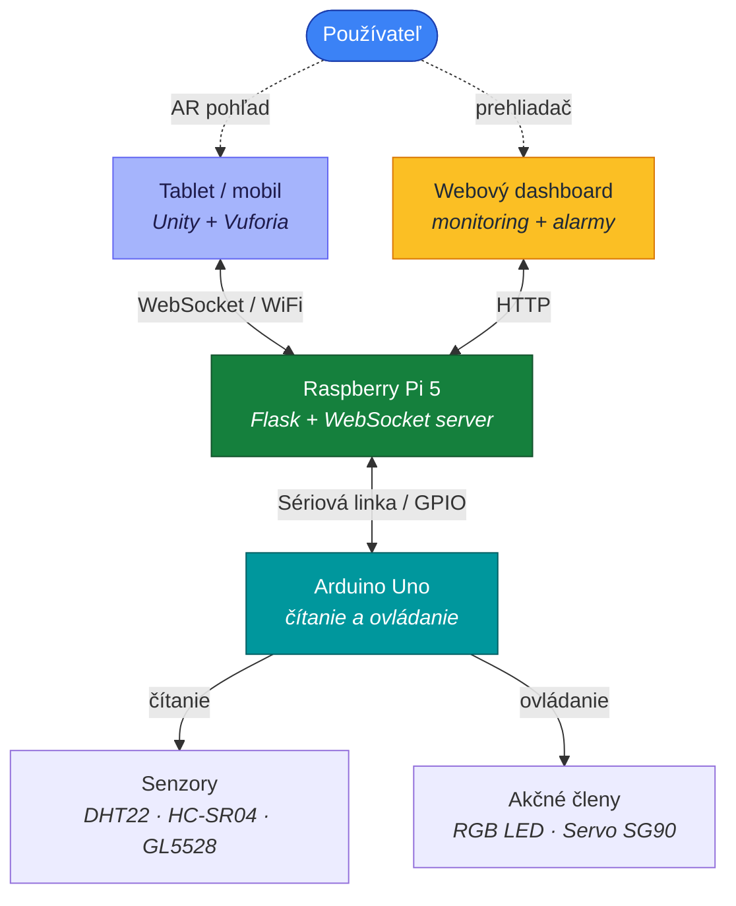

# AR IoT Smart Home

> Diplomový projekt zameraný na monitorovanie a ovládanie IoT zariadení pomocou **rozšírenej reality** a **3D identifikátorov**.


---

## O projekte

Projekt prepája laboratórny model inteligentnej domácnosti s mobilnou AR aplikáciou vytvorenou v prostredí **Unity**. Po rozpoznaní 3D identifikátora si používateľ priamo cez kameru zariadenia pozrie aktuálne hodnoty zo senzorov a môže interaktívne ovládať vybrané akčné členy — všetko v rozhraní rozšírenej reality. Súčasťou riešenia je aj doplnková **webová aplikácia** na monitoring historických dát a nastavovanie alarmových limitov.

---

## Hlavné funkcionality

- ▸ **Rozpoznávanie 3D identifikátorov** pomocou Vuforia Engine
- ▸ **Zobrazovanie AR panela** priamo nad rozpoznaným objektom
- ▸ **Live senzorické hodnoty** v AR rozhraní
- ▸ **Ovládanie akčných členov** (RGB LED + servomotor) z AR aplikácie
- ▸ **WebSocket komunikácia** v reálnom čase: Unity ↔ Raspberry Pi
- ▸ **Sériová komunikácia** Raspberry Pi ↔ Arduino
- ▸ **Webový dashboard** s históriou meraní a nastavením alarmov

### Sledované veličiny

| Veličina | Senzor | Jednotka |
|---|---|---|
| Teplota | DHT22 | °C |
| Vlhkosť | DHT22 | % |
| Intenzita osvetlenia | GL5528 (fotorezistor) | % |
| Vzdialenosť | HC-SR04 | cm |

---

## Architektúra systému



---

## Štruktúra projektu

```
ARIoTSmartHome/
├── unity-app/ARIoTSmartHome/        — Android AR aplikácia v Unity
├── raspberry-pi-server/             — Server bežiaci na Raspberry Pi
├── raspberry-pi-dashboard/          — Doplnková webová monitorovacia aplikácia
└── arduino/smart_home_controller/   — Sketch pre mikrokontrolér Arduino
```

---

## Hardvérové prvky

### Senzory

| Senzor | Funkcia |
|---|---|
| **DHT22** | teplota a vlhkosť |
| **HC-SR04** | ultrazvukové meranie vzdialenosti |
| **GL5528** | intenzita osvetlenia (fotorezistor) |

### Akčné členy

| Komponent | Účel |
|---|---|
| **RGB LED** | farebné ambient osvetlenie |
| **Servomotor SG90** | simulácia pohybu žalúzií |

---

## Princíp fungovania

1. **Arduino** číta údaje zo senzorov a odosiela ich cez sériové rozhranie.
2. **Raspberry Pi** prijíma údaje, spracováva ich a posiela ich do Unity aplikácie cez WebSocket.
3. **Unity aplikácia** po rozpoznaní 3D identifikátora zobrazí AR panel s aktuálnymi údajmi.
4. **Používateľ** môže cez AR panel interaktívne ovládať RGB LED a servomotor.
5. **Webový dashboard** beží paralelne, zobrazuje aktuálne a historické dáta a umožňuje nastavovať alarmové limity.

---

## Spustenie projektu

### 1. Arduino

Nahraj sketch z priečinka:

```text
arduino/smart_home_controller/
```

### 2. Raspberry Pi server

```bash
cd raspberry-pi-server
source .venv/bin/activate
python src/main.py
```

### 3. Webový dashboard

```bash
cd raspberry-pi-dashboard
source .venv/bin/activate
python app.py
```

Dashboard bude dostupný v prehliadači na adrese:

```text
http://IP_ADRESA_RASPBERRY_PI:5000
```

### 4. Unity / Android aplikácia

1. Otvor projekt v prostredí **Unity**.
2. Nastav správnu **IP adresu** Raspberry Pi v komunikačnom skripte.
3. Vytvor **Android build** (`.apk`).
4. Nainštaluj aplikáciu do tabletu alebo mobilu.
5. Po spustení aplikácie nasmeruj kameru na 3D identifikátor.

---

## Poznámky a tipy

> [!NOTE]
> **Sieť** — Tablet a Raspberry Pi musia byť pripojené do **rovnakej WiFi siete**.

> [!TIP]
> **Osvetlenie** — Na úspešné rozpoznávanie identifikátorov je vhodné použiť bežné alebo silnejšie osvetlenie.

> [!WARNING]
> **Pozadie** — Pri nevhodnom pozadí pod identifikátorom alebo pri slabom osvetlení môže dôjsť k pomalšiemu alebo nesprávnemu rozpoznaniu.
